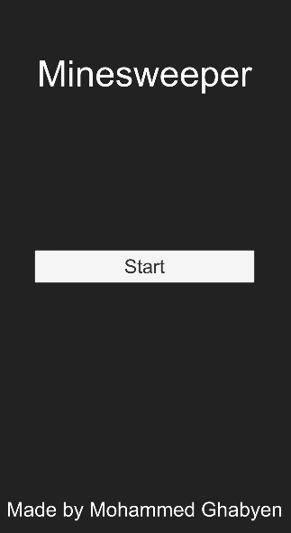
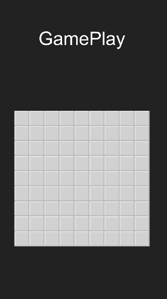
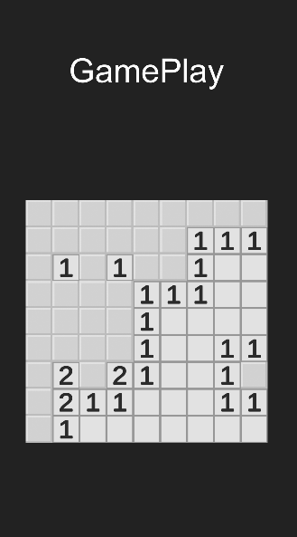
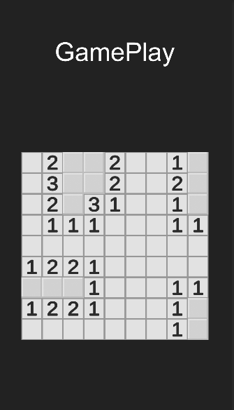
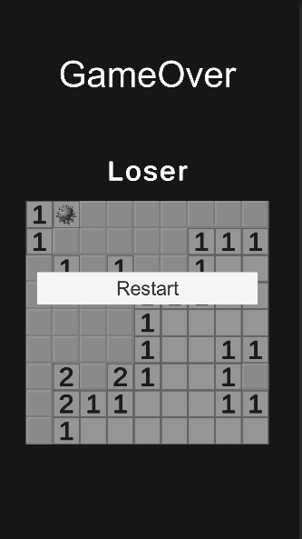

# MineSweeper
* This is a sample unity project, its a mineSweeper algorithm.

# How it works
* Minesweeper is a single-player puzzle video game. The objective of the game is to clear a rectangular board containing hidden "mines" or bombs without detonating any of them, with help from clues about the number of neighboring mines in each field.

### Photos of The Game

   
  

